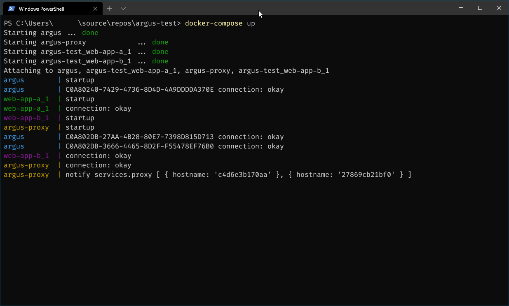

# argus-node

Container lifecycle watcher and config distribution with websockets

## Install

`npm install -g incureforce/argus-node.git`

## Launch

To launch it just `argus-node` in your favorite shell. 

If argus-node finds a "app-shell.js" file it enters client mode, if not it enters server mode.

### `app-shell.js`

#### webapp-sample

Sample `app-shell.js` for a `web-app` container.

When it launches it registers config values under `service.proxy` (hostname).

```javascript
const os = require('os')

module.exports = {
    url: "http://argus/",

    startup: function (ctx) {
        ctx.update('services.proxy', {
            hostname: os.hostname()
        })
    },

    dispose: function (ctx) {
        ctx.update('services.proxy')
    },
}
```

#### proxy-sample

Sample `app-shell.js` for a `proxy` container.

When it launches it fetches all config values under `service.proxy` and prints them to `stdout`. Every time a new clients connects we get a notify callback with all config values under `serivce.proxy`.

```javascript
module.exports = {
    url: "http://argus/",

    startup: function (ctx) {
        ctx.notify('services.proxy', function (path, content) {
            console.log('notify', path, content)
        })
    },

    dispose: function (ctx) {
    },
}
```

#### docker-compose sample

You can try it out yourself: [Link](./test/docker-compose.yml)

```docker-compose
version: "3.3"
services:
  argus:
    build: argus-node
    image: argus-node
    networks:
      - test
    hostname: argus
    container_name: argus
  web-proxy:
    build: argus-proxy
    image: argus-proxy
    networks:
      - test
    hostname: argus-proxy
    depends_on:
      - argus
    container_name: argus-proxy
  web-app-a:
    build: argus-web-app
    image: argus-web-app
    depends_on:
      - argus
    networks:
      - test
  web-app-b:
    build: argus-web-app
    image: argus-web-app
    depends_on:
      - argus
    networks:
      - test

networks:
  test:
```

